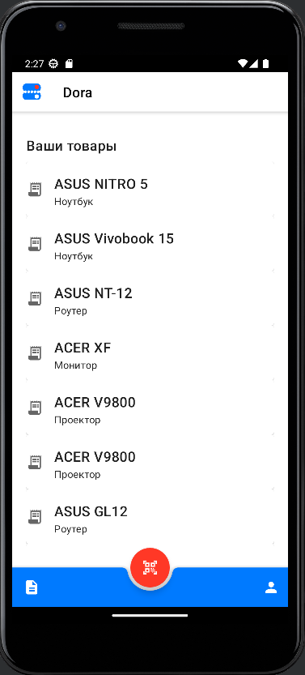
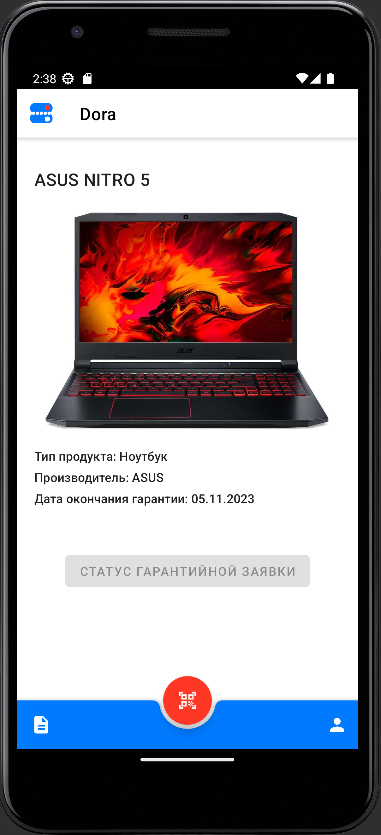
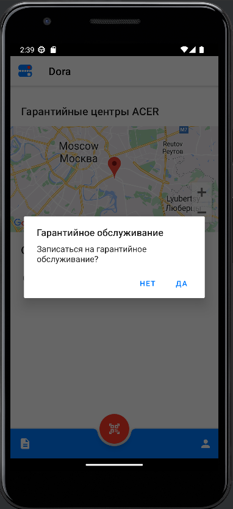

## Приложение Dora

### Описание сервиса
Данный сервис поможет клиентам хранить и отслеживать свои гарантийные талоны на технические изделия.  
  
С помощью мобильного приложения можно отсканировать QR-код, сгенерированный производителем, для добавления товара 
в список гарантий.  
При нажатии на товар открывается его карточка с дополнительными данными.  
  

Для товара, у которого еще не истек гарантийный период, есть возможность просмотреть гарантийные центры и
предварительно записаться на обслуживание.  
  

